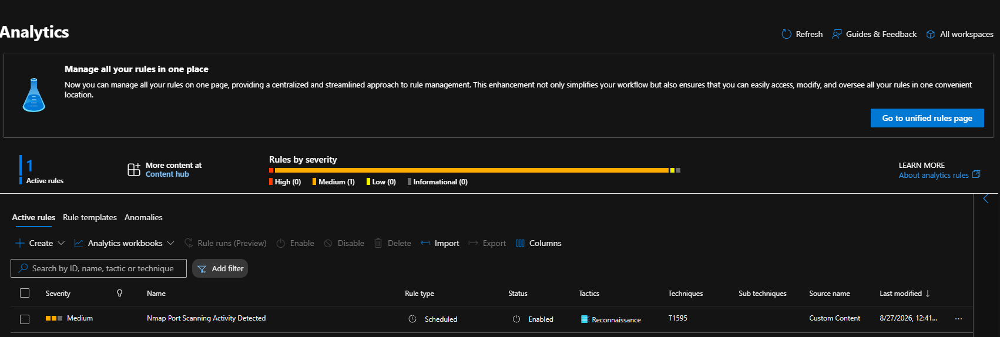
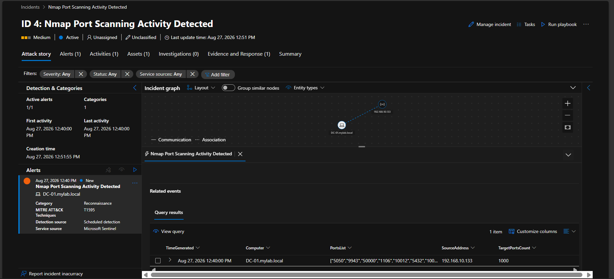

# 📄 Detection Rule 1: Nmap Port Scanning Activity Detected


## 📌 Overview

- **Rule Name:** Nmap Port Scanning Activity Detected
- **Severity:** Medium
- **MITRE ATT&CK:** Reconnaissance → Active Scanning: Port Scanning (`T1595.001`)
- **Entities:** Source IP (`SourceAddress`), Destination Host (`Computer`)

## 📝 Description

This Microsoft Sentinel Analytic Rule detects high-volume port scanning activity originating from a single source IP.

It monitors Windows Filtering Platform events for both allowed and blocked connection attempts:

- **5156** — Allowed Network Connection
- **5157** — Blocked Network Connection
- **5152** — Network Packet Drop

The rule extracts the destination port from `EventData` and triggers when a single source IP attempts connections to **more than 25 distinct ports within 5 minutes**.

This approach helps detect aggressive scanning activity such as Nmap, including scans involving open, closed, or filtered ports.

## 💻 KQL Query

```kql
SecurityEvent
| where TimeGenerated > ago(5m)
| where EventID in (5156, 5157, 5152)
| parse EventData with * '<Data Name="SourceAddress">' SourceAddress '</Data>' * '<Data Name="DestPort">' TargetPort '</Data>' *
| where SourceAddress startswith "192.168."
| where SourceAddress != "::1"
    and SourceAddress != "127.0.0.1"
    and isnotempty(SourceAddress)
| summarize TargetPortsCount = dcount(TargetPort),
            PortsList = make_set(TargetPort)
    by SourceAddress, Computer, bin(TimeGenerated, 5m)
| where TargetPortsCount > 25
| project TimeGenerated, SourceAddress, Computer, TargetPortsCount, PortsList
````

## 🎯 Alert Configuration

### 🔹 Alert Grouping

Alerts are grouped into a single incident when the same source IP and destination host are involved, reducing duplicate alerts and SOC alert fatigue.

### 📸 Analytic Rule Configuration




## 🚨 Detection Result

The rule successfully detected Nmap port scanning activity originating from `192.168.10.133` against the Domain Controller `DC-01.mylab.local`.

The generated Microsoft Sentinel incident contained:

* **Source IP:** `192.168.10.133`
* **Destination Host:** `DC-01.mylab.local`
* **Target Ports:** 1000 unique ports
* **Detection Time:** August 27, 2026 at 12:40 PM
* **Severity:** Medium
* **MITRE ATT&CK Technique:** `T1595`

### 📸 Sentinel Incident



## 🛡️ MITRE ATT&CK Mapping

### T1595.001 — Active Scanning: Port Scanning

* **Tactic:** Reconnaissance
* **Technique:** Active Scanning: Port Scanning


