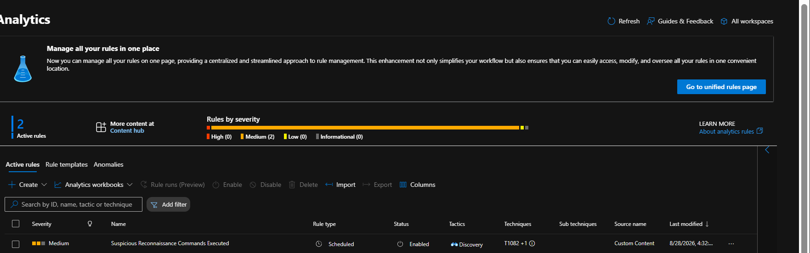
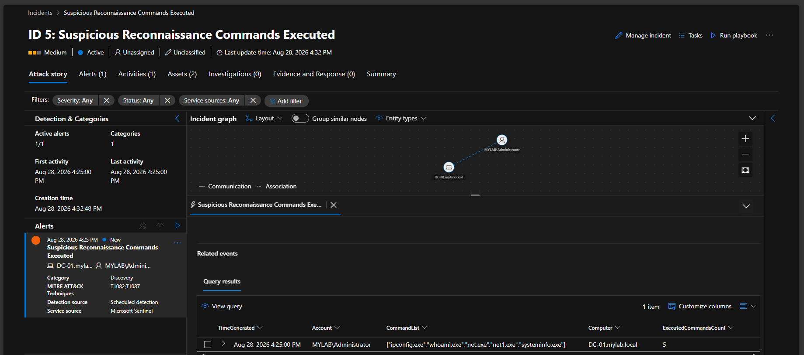

# 📄 Detection Rule 2: Suspicious Discovery Commands Executed

## 📌 Overview

- **Rule Name:** Suspicious Discovery Commands Executed
- **Severity:** Medium
- **MITRE ATT&CK:** Discovery → System Information Discovery (`T1082`), Account Discovery (`T1087`)
- **Data Source:** Windows `SecurityEvent` — Event ID `4688`
- **Target Entities:** `Computer`, `Account`

## 📝 Description

This Microsoft Sentinel Analytic Rule detects multiple Windows discovery commands executed rapidly by the same user on the same host.

Monitored commands include:

- `whoami.exe`
- `net.exe`
- `net1.exe`
- `ipconfig.exe`
- `systeminfo.exe`
- `nltest.exe`

The rule triggers when **2 or more distinct discovery tools** are executed within a **5-minute window** by the same account on the same computer.

## 💻 KQL Query

```kql
SecurityEvent
| where TimeGenerated > ago(5m)
| where EventID == 4688
| extend ProcessName = tolower(tostring(parse_path(NewProcessName).Filename))
| where ProcessName in ("whoami.exe", "net.exe", "net1.exe", "ipconfig.exe", "systeminfo.exe", "nltest.exe")
| summarize ExecutedCommandsCount = dcount(ProcessName),
            CommandList = make_set(ProcessName)
    by Account, Computer, bin(TimeGenerated, 5m)
| where ExecutedCommandsCount >= 2
| project TimeGenerated, Computer, Account, ExecutedCommandsCount, CommandList
````

## 🎯 Entity Mapping

* **Host:** `Computer`
* **Account:** `Account`

## ⚙️ Analytic Rule Configuration



## 🔎 Detection Logic

```text
Event ID 4688
      ↓
Discovery Commands
      ↓
Same User + Host
      ↓
≥ 2 Distinct Tools / 5 Minutes
      ↓
Microsoft Sentinel Alert
      ↓
SOC Investigation
```

## 🚨 Detection Result

The rule successfully detected multiple discovery commands executed on the Domain Controller.

* **Account:** `MYLAB\Administrator`
* **Computer:** `DC-01.mylab.local`
* **Detection Time:** August 28, 2026 at 4:25 PM
* **Commands Detected:** `ipconfig.exe`, `whoami.exe`, `net.exe`, `net1.exe`, `systeminfo.exe`
* **Distinct Commands:** `5`
* **Severity:** Medium



## 🛡️ MITRE ATT&CK

### T1082 — System Information Discovery

**Tactic:** Discovery

### T1087 — Account Discovery

**Tactic:** Discovery

> **Lab Scope:** Developed and tested in an isolated SOC home lab for defensive security research and SOC Tier 1 training.

```
```
