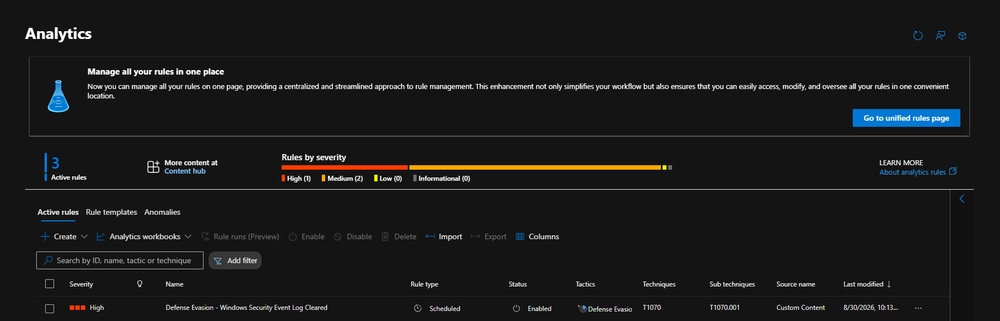
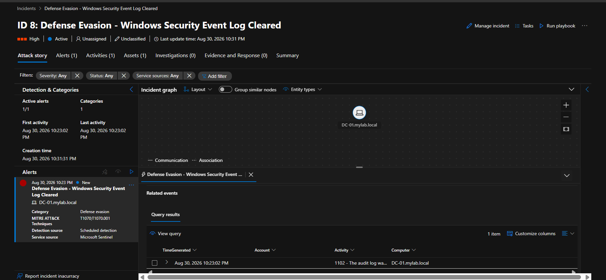

# 📄 Detection Rule 3: Windows Security Event Log Cleared

## 📌 Overview

* **Rule Name:** Windows Security Event Log Cleared
* **Severity:** High
* **MITRE ATT&CK:** Defense Evasion → Indicator Removal: Clear Windows Event Logs (`T1070.001`)
* **Entities:** Host (`Computer`), Account (`Account`)

## 📝 Description

This Microsoft Sentinel Analytic Rule detects when the Windows Security Event Log is cleared.

It monitors Windows Security Event Log events:

* **1102** — The audit log was cleared

Event ID `1102` is generated when the Windows Security audit log is cleared. Attackers may perform this action to remove evidence of previous activity and evade detection.

## 💻 KQL Query

```kql
SecurityEvent
| where TimeGenerated > ago(5m)
| where EventID == 1102
| project TimeGenerated, Computer, Account, Activity
```

### 📸 Analytic Rule Configuration



## 🚨 Detection Result

The rule successfully detected a Windows Security Event Log clearing activity on the Domain Controller `DC-01.mylab.local`.

The generated Microsoft Sentinel incident contained:

* **Computer:** `DC-01.mylab.local`
* **Event ID:** `1102`
* **Severity:** High
* **MITRE ATT&CK Technique:** `T1070.001`

### 📸 Sentinel Incident



## 🛡️ MITRE ATT&CK Mapping

### T1070.001 — Clear Windows Event Logs

* **Tactic:** Defense Evasion
* **Technique:** Indicator Removal: Clear Windows Event Logs

