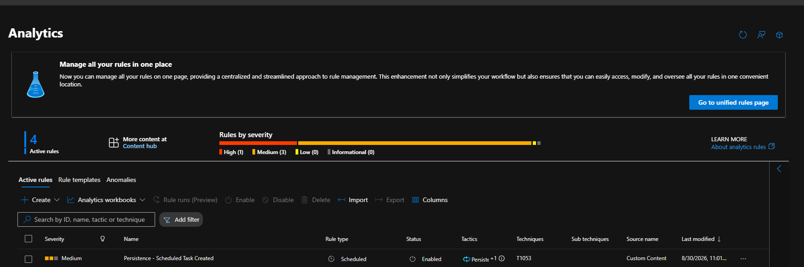
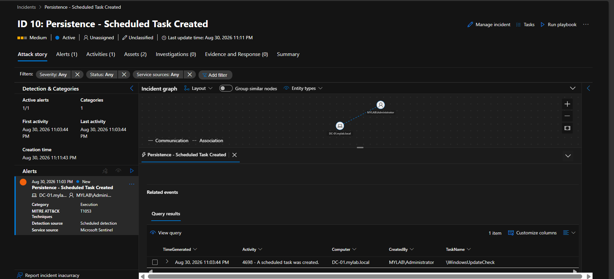

# 📄 Detection Rule 4: Scheduled Task Created

## 📌 Overview

* **Rule Name:** Scheduled Task Created
* **Severity:** Medium
* **MITRE ATT&CK:** Persistence → Scheduled Task/Job: Scheduled Task (`T1053.005`)
* **Entities:** Host (`Computer`), Account (`CreatedBy`)

## 📝 Description

This Microsoft Sentinel Analytic Rule detects the creation of new scheduled tasks on Windows endpoints.

It monitors Windows Security Event Log events:

* **4698** — A scheduled task was created

Scheduled Tasks are commonly used by attackers to establish **persistence** or execute commands automatically at predefined times or during system startup.

The rule parses the XML event data to extract:

* **Task Name** — The name of the newly created scheduled task
* **Subject User Name** — The account that created the task
* **Subject Domain Name** — The domain associated with the account

The extracted domain and username are combined into a single `CreatedBy` field to identify the account responsible for creating the scheduled task.

## 💻 KQL Query

```kql
SecurityEvent
| where TimeGenerated > ago(5m)
| where EventID == 4698
| extend XmlData = parse_xml(EventData).EventData.Data
| mv-apply Data = XmlData on (
    where Data["@Name"] in ("TaskName", "SubjectUserName", "SubjectDomainName")
    | summarize 
        TaskName = take_anyif(tostring(Data["#text"]), Data["@Name"] == "TaskName"),
        SubjectUserName = take_anyif(tostring(Data["#text"]), Data["@Name"] == "SubjectUserName"),
        SubjectDomainName = take_anyif(tostring(Data["#text"]), Data["@Name"] == "SubjectDomainName")
)
| extend CreatedBy = strcat(SubjectDomainName, @"\", SubjectUserName)
| project TimeGenerated, Computer, TaskName, CreatedBy, Activity
```

## ⚙️ Detection Tuning

Potential false positives include legitimate scheduled tasks created by Windows, software installations, system maintenance, or authorized administrative activity.

SOC analysts should investigate the **task name, creating account, and task creation context** to determine whether the scheduled task is legitimate or potentially malicious.

### 📸 Analytic Rule Configuration



## 🚨 Detection Result

The rule successfully detected the creation of a new scheduled task on the Domain Controller `DC-01.mylab.local`.

The generated Microsoft Sentinel incident contained:

* **Computer:** `DC-01.mylab.local`
* **Created By:** `MYLAB\Administrator`
* **Task Name:** `\WindowsUpdateCheck`
* **Event ID:** `4698`
* **Severity:** Medium
* **MITRE ATT&CK Technique:** `T1053.005`

### 📸 Sentinel Incident



## 🛡️ MITRE ATT&CK Mapping

### T1053.005 — Scheduled Task

* **Tactic:** Persistence
* **Technique:** Scheduled Task/Job: Scheduled Task

