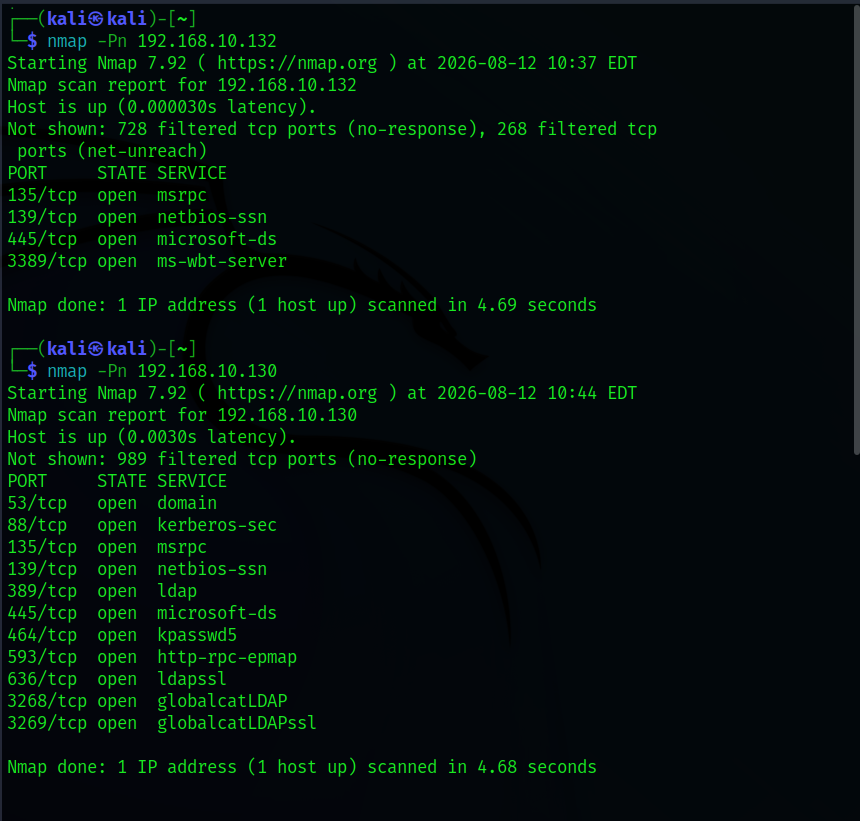
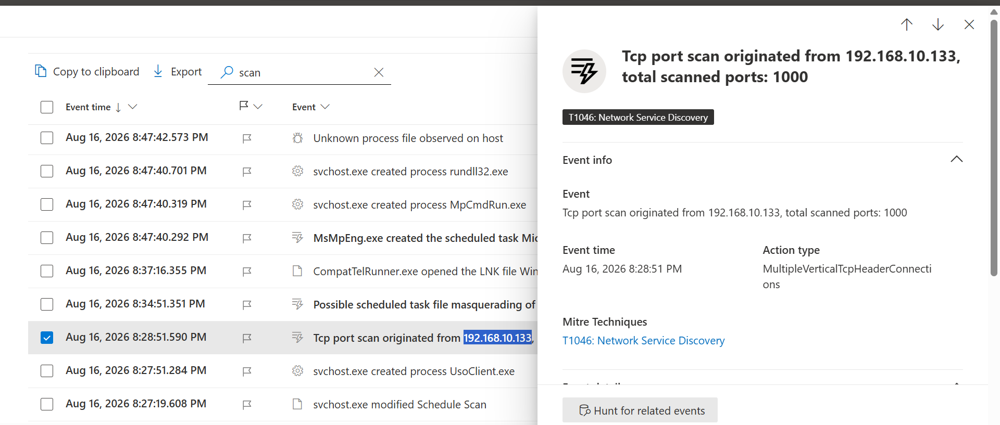
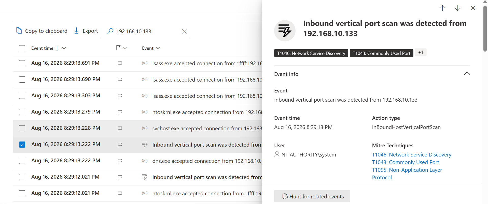
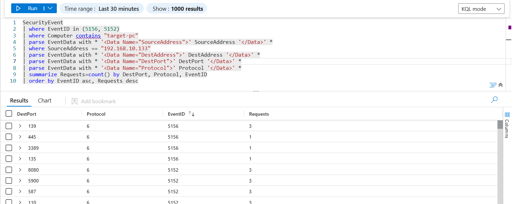
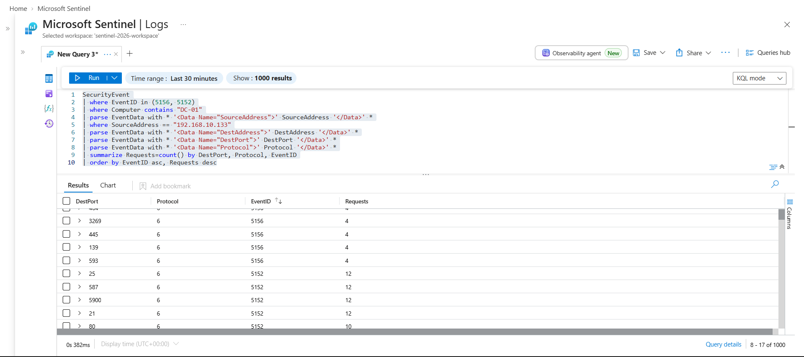

# 01 — Reconnaissance

## Network Service Discovery

The reconnaissance phase was performed from the attacker machine (`192.168.10.133`) against the Windows endpoint (`192.168.10.132`) and Domain Controller (`192.168.10.130`).

### Nmap Scan

Nmap was used with `-Pn` to perform TCP port scanning:

```bash
nmap -Pn 192.168.10.132
nmap -Pn 192.168.10.130
```

The scans identified exposed Windows and Active Directory services.



### Microsoft Defender for Endpoint

Microsoft Defender detected a TCP port scan on the victim machine and the Domain Controller originating from `192.168.10.133`, with **1000 ports scanned on each host**.

The activity was mapped to **T1046 — Network Service Discovery**.





### Microsoft Sentinel

Windows Security Events `5156` and `5152` were queried in Microsoft Sentinel to validate the network connections generated by the scan.



The same investigation was performed against the Domain Controller.



### MITRE ATT&CK

* **T1046 — Network Service Discovery**

### Detection Summary

The reconnaissance activity was successfully detected and validated across **Nmap, Microsoft Defender for Endpoint, and Microsoft Sentinel**. Microsoft Defender identified the TCP port scanning activity originating from the attacker machine, while Microsoft Sentinel provided supporting network security events to validate the connections generated during the scan.
