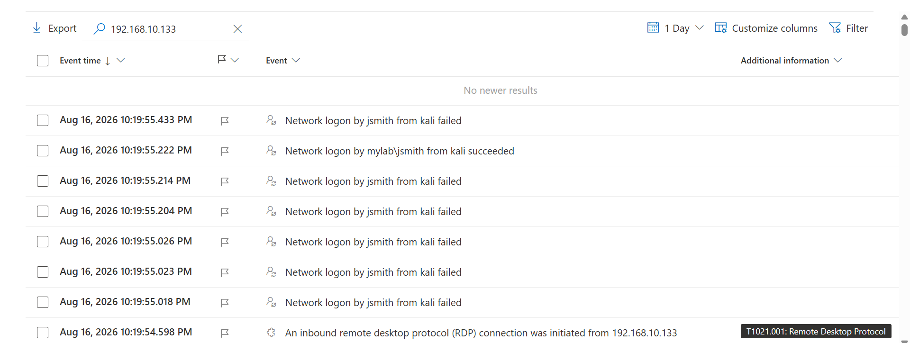
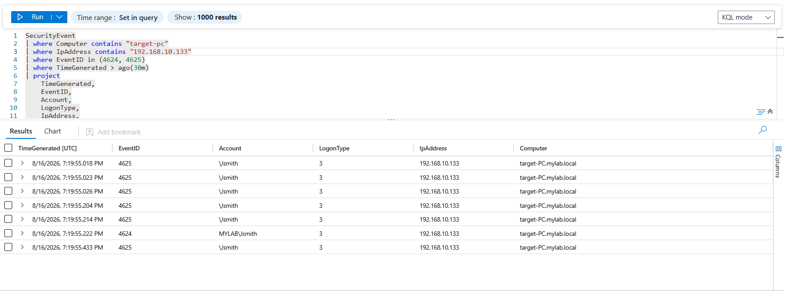
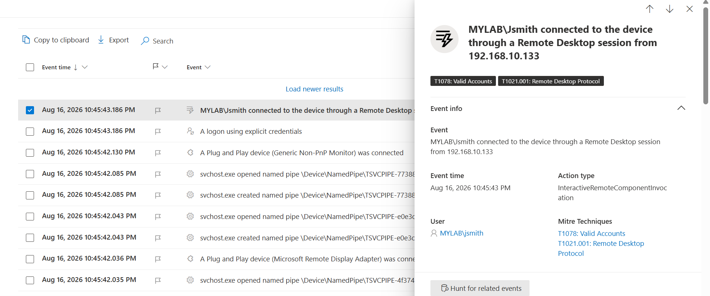
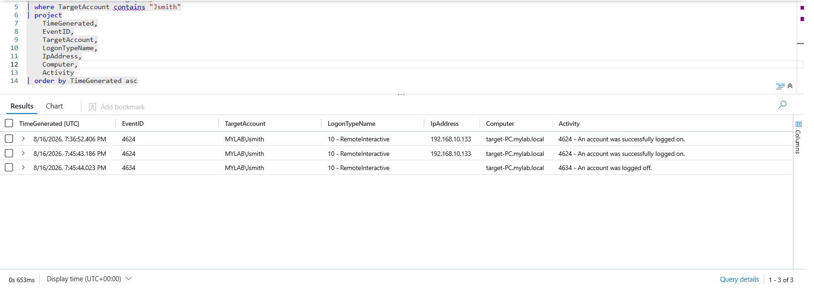

# 02 — RDP Brute Force Attack

## Credential Attack

After the reconnaissance phase identified RDP (`3389/tcp`) on `192.168.10.132`, a controlled RDP brute-force attack was performed against the domain user `MYLAB\Jsmith`.

### RDP Discovery & Brute Force

From Kali, RDP was confirmed as open and Hydra was used to perform the credential attack against the target.

The attack generated multiple authentication attempts against `192.168.10.132`.

### Microsoft Defender for Endpoint

Microsoft Defender recorded the RDP activity and multiple failed authentication attempts from `192.168.10.133`, followed by a successful authentication for `MYLAB\Jsmith`.

### Microsoft Sentinel

Sentinel was used to correlate the authentication events. The results showed multiple **4625 Failed Logon** events followed by a **4624 Successful Logon** from `192.168.10.133`.

### Manual RDP Login

After obtaining the credentials, a manual RDP connection was performed using `MYLAB\Jsmith`.

Defender identified:

> `MYLAB\Jsmith connected to the device through a Remote Desktop session from 192.168.10.133`

### Microsoft Sentinel — Successful RDP

Sentinel confirmed the successful interactive RDP session with:

* `Event ID: 4624`
* `Logon Type: 10 — RemoteInteractive`
* `Account: MYLAB\Jsmith`
* `Source IP: 192.168.10.133`

### MITRE ATT&CK

* **T1078 — Valid Accounts**
* **T1021.001 — Remote Desktop Protocol**

### Detection Summary

The RDP brute-force activity was successfully detected and validated across **Kali, Microsoft Defender for Endpoint, and Microsoft Sentinel**. Multiple failed authentication attempts from `192.168.10.133` were followed by a successful authentication for `MYLAB\Jsmith`. The successful RDP session was further confirmed through **Event ID 4624 with Logon Type 10**, demonstrating successful remote access using valid credentials.
