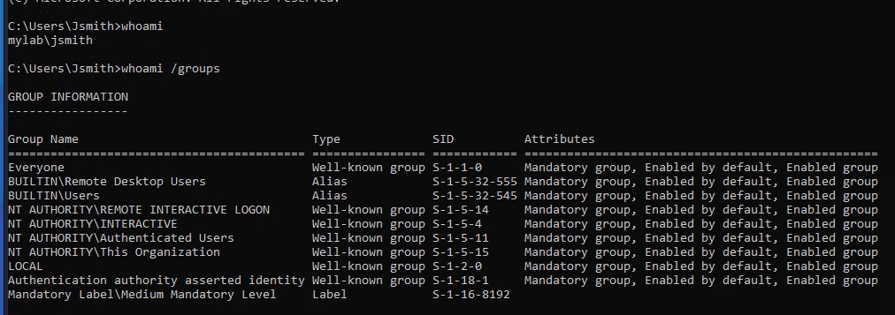
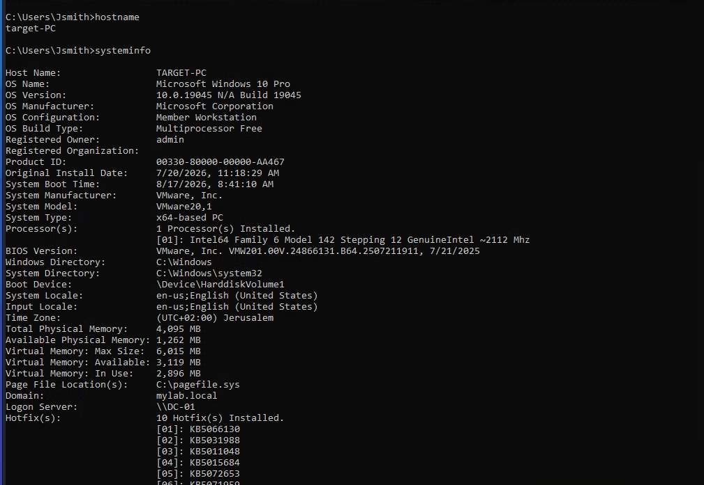
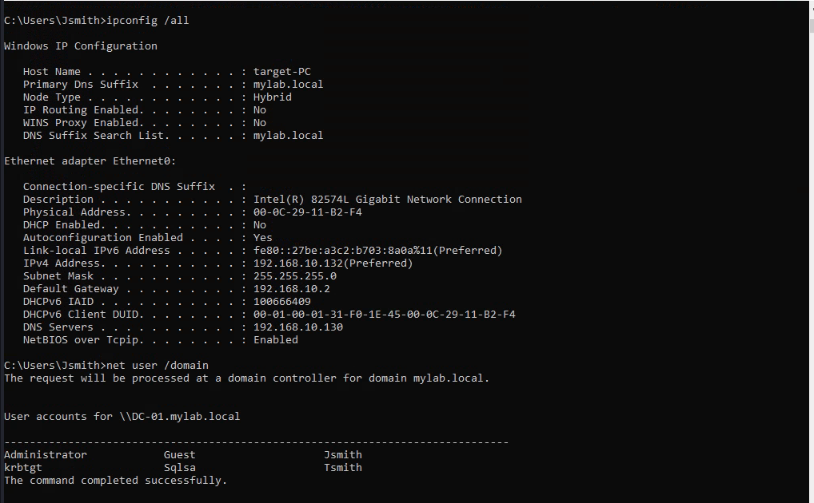
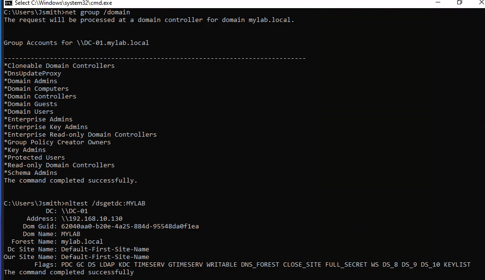
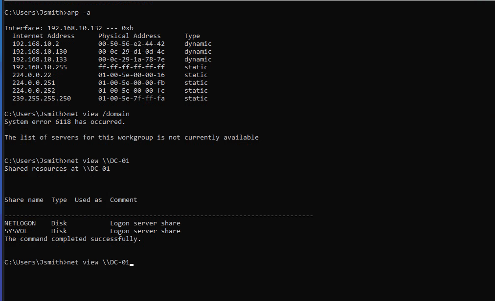
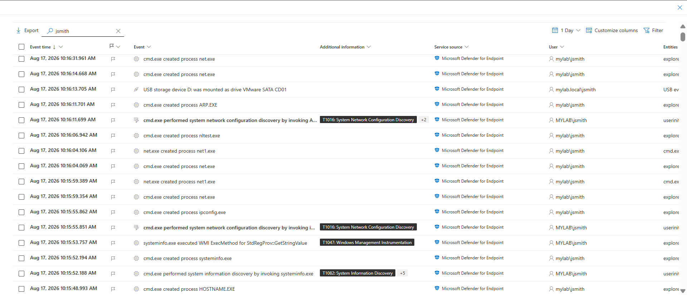
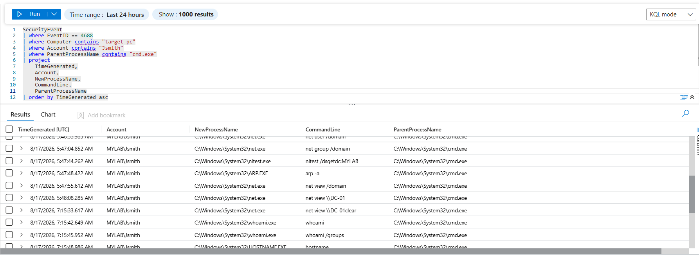

# 03 — Discovery

## System & Domain Discovery

After gaining RDP access to the Windows endpoint using the compromised domain account `MYLAB\Jsmith`, discovery activity was performed from the victim machine under the `Jsmith` user context.

### 1. System & Identity Discovery

The following commands were executed:

```cmd
hostname
systeminfo
whoami
whoami /groups
ipconfig /all
```

This provided information about the hostname, operating system, current user, group membership, and network configuration.





### 2. Domain & Account Discovery

Domain users and groups were enumerated using:

```cmd
net user /domain
net group /domain
```

The output revealed domain accounts and available domain groups.



### 3. Domain Controller Discovery

The Domain Controller was identified using:

```cmd
nltest /dsgetdc:MYLAB
```

The command identified `DC-01` at `192.168.10.130` as the Domain Controller for the `MYLAB` domain.



### 4. Network Share Discovery

Available network shares on the Domain Controller were enumerated using:

```cmd
net view \\DC-01
```

The results identified the `NETLOGON` and `SYSVOL` shares.



### 5. Defender for Endpoint

Microsoft Defender for Endpoint recorded the discovery activity performed by `MYLAB\Jsmith`, including execution of `systeminfo.exe`, `ipconfig.exe`, `ARP.EXE`, `net.exe`, and `nltest.exe`.

The activity was associated with techniques including:

* **T1016 — System Network Configuration Discovery**
* **T1082 — System Information Discovery**



### 6. Sentinel Investigation

Microsoft Sentinel was used to investigate the process execution events generated during the discovery activity.

The results confirmed that the discovery commands were executed by `MYLAB\Jsmith` through `cmd.exe`, following the successful RDP compromise.



### 7. Result

The Discovery phase successfully identified:

* Hostname and operating system information
* Current user and group membership
* Network configuration
* Domain users and groups
* Domain Controller information
* Available network shares

The activity was observed through **Microsoft Defender for Endpoint and Microsoft Sentinel**, demonstrating the transition from initial RDP access to post-compromise discovery under the compromised `Jsmith` account.
