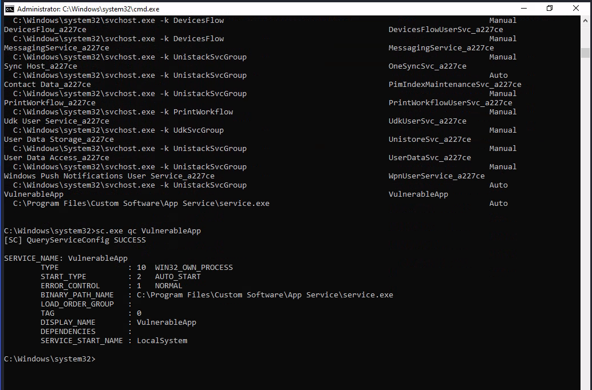
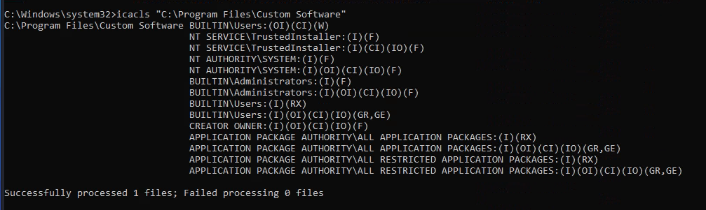
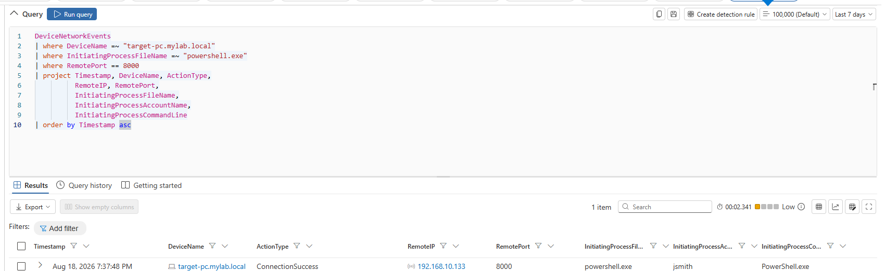
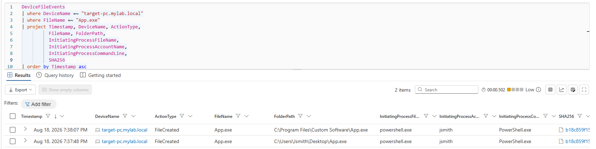
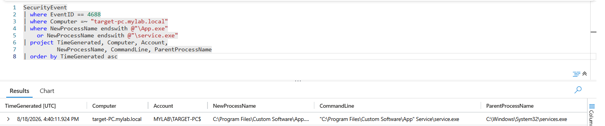
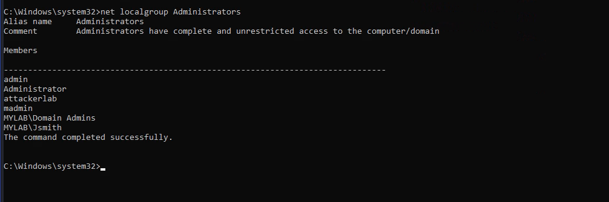
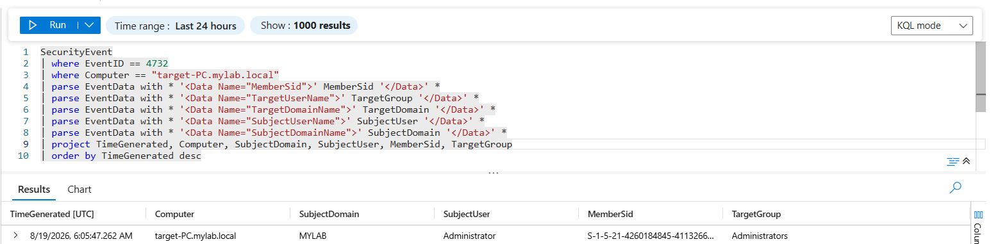

# 04 — Privilege Escalation

## Unquoted Service Path

After completing the reconnaissance phase and gaining RDP access through the RDP brute-force stage, the attacker obtained access to the victim machine as `MYLAB\Jsmith` and proceeded with local discovery to identify potential privilege escalation opportunities.

## Service Enumeration

From the compromised `Jsmith` session, Windows services were enumerated to identify potentially misconfigured services.

```cmd
wmic service get name,displayname,pathname,startmode | findstr /i /v "c:\windows\" | findstr /i /v """
```

The enumeration revealed a suspicious service named `VulnerableApp` with the following executable path:

```text
C:\Program Files\Custom Software\App Service\service.exe
```

The path contained multiple spaces and was not enclosed in quotation marks.

## Service Configuration Analysis

The service configuration was examined using:

```cmd
sc.exe qc VulnerableApp
```

The service was configured with:

* **Start Type:** `AUTO_START`
* **Service Account:** `LocalSystem`
* **Binary Path:** `C:\Program Files\Custom Software\App Service\service.exe`



The service was a pre-existing application service created during the lab setup and intentionally configured with an **Unquoted Service Path** to simulate a Windows service misconfiguration.

The corresponding Sentinel telemetry also captured the service discovery activity performed from the compromised `Jsmith` session.


## Permission Analysis

The attacker then inspected the permissions on the application directory:

```cmd
icacls "C:\Program Files\Custom Software"
```

The output displayed the ACLs assigned to the application directory, including the permissions associated with the `BUILTIN\Users` group.




## Payload Transfer

The attacker downloaded a controlled malicious payload named `App.exe` from the Kali attacker machine to the compromised endpoint.

The payload was downloaded to:

```text
C:\Users\Jsmith\Desktop\App.exe
```

Defender for Endpoint recorded the file creation activity:

* **Action:** `FileCreated`
* **Process:** `powershell.exe`
* **Account:** `jsmith`
* **File:** `C:\Users\Jsmith\Desktop\App.exe`

The EDR telemetry also showed the network connection used to transfer the payload from the attacker machine:

```text
Remote IP:   192.168.10.133
Remote Port: 8000
```




## Service Path Hijacking

The payload was then placed at:

```text
C:\Program Files\Custom Software\App.exe
```

Defender for Endpoint recorded another `FileCreated` event for the payload in the application directory, with `powershell.exe` running under the `Jsmith` account as the initiating process.



This exploited the combination of:

* Unquoted service path
* Spaces in the executable path
* Payload placement in the application directory
* `LocalSystem` service execution

## Triggering the Exploitation

The `VulnerableApp` service was configured as `AUTO_START` and executed under the `LocalSystem` account.

The payload was subsequently executed through the Windows service execution chain. Sentinel recorded the execution of:

```text
C:\Program Files\Custom Software\App.exe
```

with:

```text
Parent Process: C:\Windows\System32\services.exe
```



This provided evidence connecting the payload execution to the Windows service.

## Privilege Escalation Verification

After the service execution, the local Administrators group was checked:

```cmd
net localgroup Administrators
```

The result confirmed that:

```text
MYLAB\Jsmith
```

had been added to the local `Administrators` group.



## Defender for Endpoint

Microsoft Defender for Endpoint was investigated to reconstruct the privilege escalation chain.

The investigation identified the sequence of PowerShell network activity, payload creation on the Desktop, payload placement in the application directory and subsequent execution through the service.

This allowed the endpoint activity to be correlated back to the compromised `Jsmith` account.

## Sentinel Investigation

Microsoft Sentinel was used to investigate the corresponding Windows Security events.

The primary event of interest was:

* **Event ID 4732 — A member was added to a security-enabled local group**

The event was used to confirm the modification of the local `Administrators` group.


The resulting event showed the modification of the local `Administrators` group on `target-PC.mylab.local`.



## MITRE ATT&CK

The activity was associated with:

* **T1574.009 — Hijack Execution Flow: Path Interception by Unquoted Path**
* **T1098.007 — Account Manipulation: Additional Local or Domain Groups**

