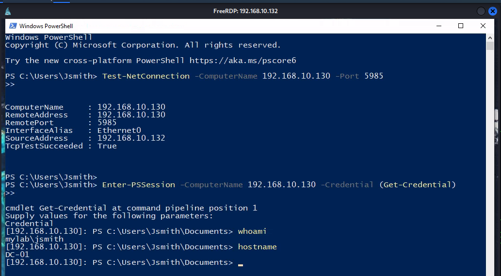
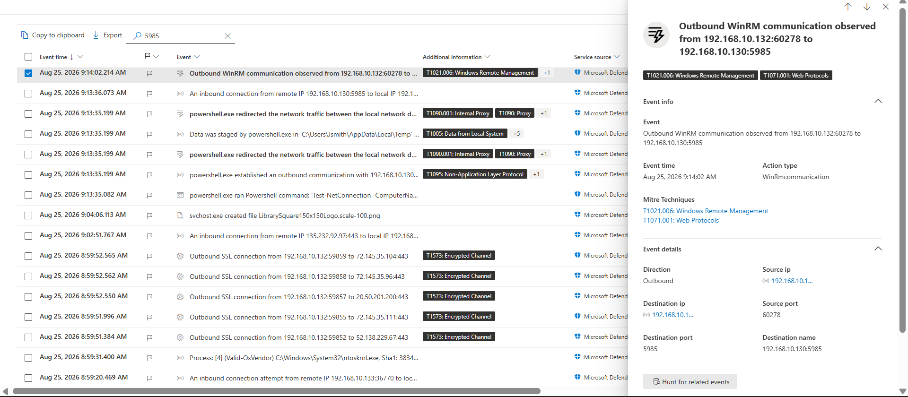
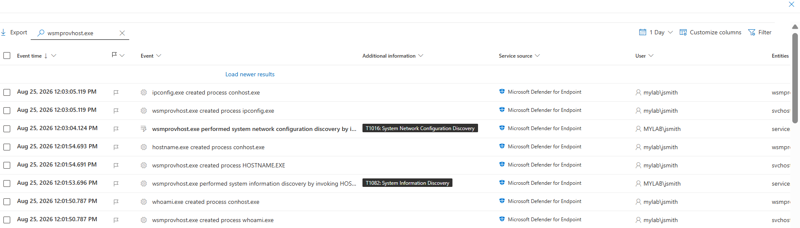
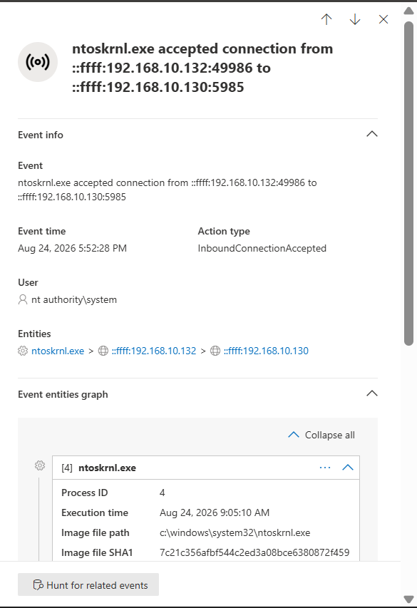
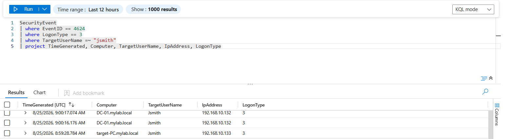

# 06 — Lateral Movement

## Remote Session via WinRM & PowerShell Remoting

After establishing persistent access on `TARGET-PC` (`192.168.10.132`), lateral movement was performed toward the Domain Controller `ADDC` (`192.168.10.130`) using **Windows Remote Management (WinRM)** and **PowerShell Remoting**.

The activity was performed under the context of:

```text
MYLAB\Jsmith
```

### Host Reachability & Port Verification

Network connectivity and WinRM availability were verified from `TARGET-PC`:

```powershell
Test-NetConnection -ComputerName 192.168.10.130 -Port 5985
```

The test confirmed successful connectivity to TCP port `5985`.

### Establishing the Remote Session

A remote PowerShell session was established using:

```powershell
Enter-PSSession -ComputerName 192.168.10.130 -Credential (Get-Credential)
```

The compromised domain credentials were supplied:

```text
Jsmith@mylab.local
```

The successful remote prompt confirmed execution on the Domain Controller:

```text
[192.168.10.130]: PS C:\Users\Jsmith\Documents>
```

The remote context was verified as:

```text
MYLAB\Jsmith
DC-01
```


### Microsoft Defender for Endpoint

Microsoft Defender for Endpoint recorded telemetry from both sides of the lateral movement.

On `TARGET-PC`, Defender recorded PowerShell activity and the outbound WinRM connection:

```text
192.168.10.132 → 192.168.10.130:5985
```



On the Domain Controller, Defender recorded `wsmprovhost.exe` creating processes such as `whoami.exe`, `hostname.exe`, and `ipconfig.exe`.



The corresponding WinRM connection was also observed:

```text
192.168.10.132:60278 → 192.168.10.130:5985
```




### Microsoft Sentinel

Microsoft Sentinel was used to correlate the endpoint and authentication telemetry.

The investigation identified a successful Windows network logon:

```text
Event ID: 4624
Logon Type: 3
Account: Jsmith
```

The activity provided additional authentication evidence supporting the lateral movement investigation.



### MITRE ATT&CK

* **T1021.006 — Windows Remote Management**
* **T1082 — System Information Discovery**
* **T1016 — System Network Configuration Discovery**
* **T1071.001 — Web Protocols**

### Detection Summary

The lateral movement activity was successfully detected and validated across **Microsoft Defender for Endpoint and Microsoft Sentinel**. Defender recorded the WinRM connection from `TARGET-PC` to the Domain Controller and the resulting `wsmprovhost.exe` process activity. Sentinel provided supporting authentication telemetry through **Event ID 4624 with Logon Type 3**, confirming successful remote access to the Domain Controller under the `MYLAB\Jsmith` account.
