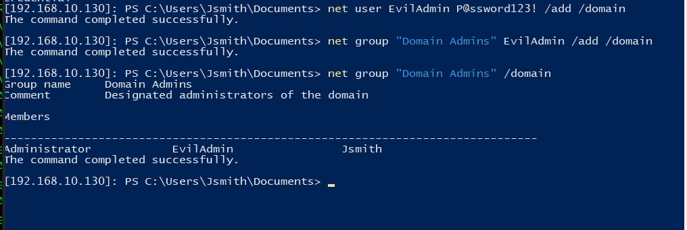
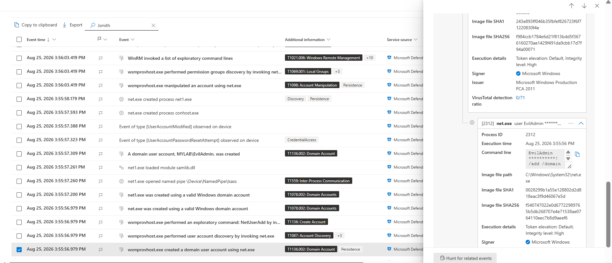
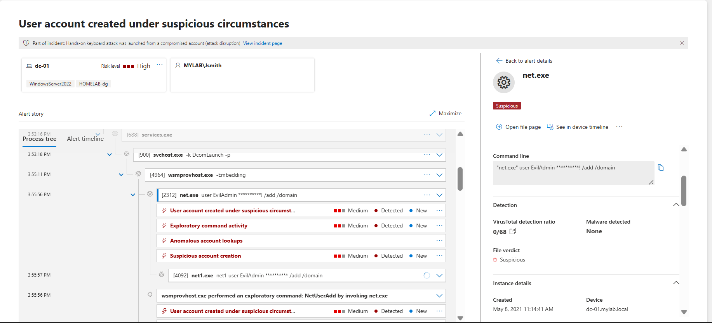
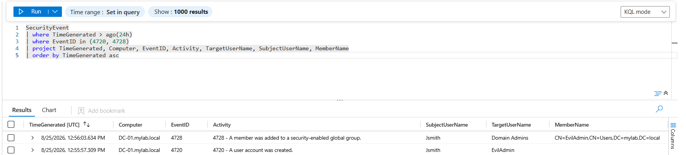

# 07 — Domain Compromise

## Domain Compromise via Backdoor Account Creation

After establishing a remote session on the Domain Controller `ADDC` (`192.168.10.130`) via WinRM, post-exploitation activity was performed to establish domain-level persistence.

The activity was executed directly on the Domain Controller under the remote context of:

```text
MYLAB\Jsmith
```

### Domain User Creation & Privilege Escalation

A new domain user account was created and added to the `Domain Admins` group:

```powershell
net user EvilAdmin P@ssword123! /add /domain
net group "Domain Admins" EvilAdmin /add /domain
```

Group membership was then verified:

```powershell
net group "Domain Admins" /domain
```

The output confirmed that `EvilAdmin` was successfully added to the `Domain Admins` group alongside the existing administrators.



This demonstrated successful creation of a privileged domain account and establishment of domain-level persistence.

### Microsoft Defender for Endpoint

Microsoft Defender for Endpoint recorded the activity on the Domain Controller.

The telemetry showed `wsmprovhost.exe` invoking `net.exe` to create the `EvilAdmin` domain account and modify group membership.

Defender also detected suspicious account creation and anomalous account activity.



The process activity confirmed the relationship between the remote PowerShell session, `wsmprovhost.exe`, and the `net.exe` / `net1.exe` commands used to modify Active Directory.



### Microsoft Sentinel

Microsoft Sentinel was used to correlate the Windows Security events generated during the account creation and privilege assignment.

The investigation identified:

```text
Event ID: 4720 — A user account was created
Event ID: 4728 — A member was added to a security-enabled global group
Target Account: EvilAdmin
Group Name: Domain Admins
```

The events showed `Jsmith` as the account performing the activity and `EvilAdmin` as the newly created privileged account.



### MITRE ATT&CK

* **T1136.002 — Create Account: Domain Account**
* **T1098 — Account Manipulation**

### Detection Summary

The domain compromise activity was successfully detected and validated across **Microsoft Defender for Endpoint and Microsoft Sentinel**. Defender recorded the creation of the `EvilAdmin` domain account and the subsequent group modification, while Sentinel confirmed the activity through **Event ID 4720** and **Event ID 4728**. The investigation demonstrated successful creation of a privileged domain account and establishment of domain-level persistence.

