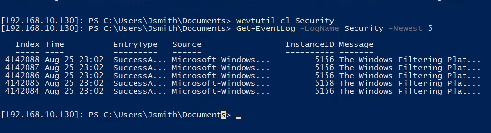
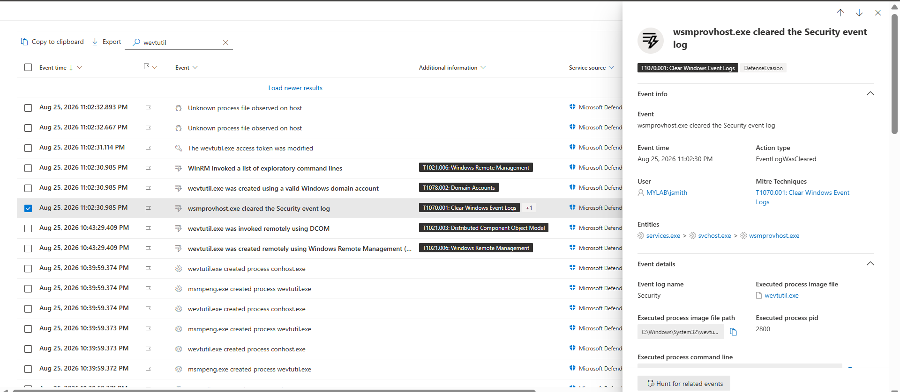
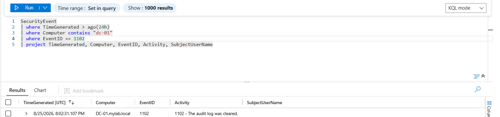

# 08 — Defense Evasion

## Clearing Windows Security Event Logs

In an attempt to disrupt SOC forensic analysis and remove historical security evidence, the attacker cleared the Windows Security Event Log on the Domain Controller (`DC-01`).

The activity was performed remotely through WinRM using the compromised domain account:

### Attacker Context

```text
MYLAB\Jsmith
```

---

## 1. Event Log Cleared via Command Line

The attacker used the built-in Windows utility `wevtutil.exe` through the established PowerShell Remoting session to clear the Security event log.

### Command Executed

```powershell
wevtutil cl Security
```

The command was executed remotely on the Domain Controller:

```text
[192.168.10.130]: PS C:\Users\Jsmith\Documents>
```

### Verification

Immediately after clearing the log, the attacker verified the remaining Security events using:

```powershell
Get-EventLog -LogName Security -Newest 5
```

The command returned only newly generated security events, demonstrating that the previous Security event history had been cleared.

### Attacker-Side Evidence

The following screenshot demonstrates the remote WinRM session, execution of `wevtutil cl Security`, and verification using `Get-EventLog`.



---

## 2. Microsoft Defender for Endpoint Detection

Microsoft Defender for Endpoint detected the execution of `wevtutil.exe` and generated telemetry showing that the Security event log was cleared.

The EDR investigation identified the following activity:

* **Event:** `wsmprovhost.exe cleared the Security event log`
* **Action Type:** `EventLogWasCleared`
* **User:** `MYLAB\Jsmith`
* **Event Log:** `Security`
* **Executed Process:** `wevtutil.exe`
* **Process Path:** `C:\Windows\System32\wevtutil.exe`
* **MITRE ATT&CK:** `T1070.001 — Clear Windows Event Logs`

The process chain observed by Defender included:

```text
services.exe
    ↓
svchost.exe
    ↓
wsmprovhost.exe
    ↓
wevtutil.exe
```

This process relationship is important from a SOC perspective because `wsmprovhost.exe` is associated with Windows Remote Management and PowerShell Remoting. The execution of `wevtutil.exe` from this context provided additional evidence that the log-clearing activity was performed remotely.

### Microsoft Defender for Endpoint Evidence

The following screenshot shows the Defender for Endpoint detection for:

> `wsmprovhost.exe cleared the Security event log`

It also shows the associated MITRE ATT&CK technique, user context, action type, process information, and process hierarchy.



---

## 3. Microsoft Sentinel Investigation

Although the local Security log was cleared, Windows generated **Event ID 1102** when the audit log was cleared.

Event ID `1102` is recorded when:

> `The audit log was cleared.`

Microsoft Sentinel received the event through the configured log collection pipeline, allowing the SOC analyst to identify the anti-forensic activity even after the local Security log had been cleared.

### KQL Investigation

The following KQL query was used to search for Windows Security Event Log clearing activity on the Domain Controller:

```kql
SecurityEvent
| where TimeGenerated > ago(24h)
| where Computer contains "dc-01"
| where EventID == 1102
| project TimeGenerated, Computer, EventID, Activity, SubjectUserName
```

### Query Results

The query returned the following relevant event:

* **TimeGenerated:** `8/25/2026 8:02:31.107 PM`
* **Computer:** `DC-01.mylab.local`
* **Event ID:** `1102`
* **Activity:** `1102 - The audit log was cleared.`

The result confirms that the Security audit log was cleared on the Domain Controller.

### Microsoft Sentinel Evidence

The following screenshot demonstrates the KQL investigation and the resulting Event ID `1102` entry for `DC-01.mylab.local`.



---

## 4. Investigation Timeline

The activity can be reconstructed as the following attack timeline:

```text
Compromised Domain Account
        ↓
MYLAB\Jsmith
        ↓
WinRM / PowerShell Remoting
        ↓
wsmprovhost.exe
        ↓
wevtutil.exe
        ↓
Security Event Log Cleared
        ↓
Windows Event ID 1102 Generated
        ↓
Microsoft Defender for Endpoint Detection
        ↓
Microsoft Sentinel Ingestion
        ↓
SOC Investigation Using KQL
```

---

## 5. MITRE ATT&CK Mapping

### T1070.001 — Clear Windows Event Logs

**Tactic:** Defense Evasion

**Technique:** Indicator Removal on Host: Clear Windows Event Logs

The attacker attempted to remove security telemetry from the compromised Domain Controller by clearing the Windows Security Event Log.

The activity was detected through multiple telemetry sources:

* **Windows:** Event ID `1102`
* **Microsoft Defender for Endpoint:** `EventLogWasCleared`
* **Microsoft Sentinel:** `SecurityEvent` telemetry
* **MITRE ATT&CK:** `T1070.001`

---

## 6. SOC Analyst Takeaways

From a SOC Tier 1 investigation perspective, the key indicators were:

### Suspicious Process

```text
wevtutil.exe
```

### Suspicious Parent Process

```text
wsmprovhost.exe
```

### Suspicious Command

```powershell
wevtutil cl Security
```

### Relevant Windows Event

```text
Event ID 1102 — The audit log was cleared
```

### MITRE ATT&CK Technique

```text
T1070.001 — Clear Windows Event Logs
```

The combination of remote PowerShell execution, `wsmprovhost.exe`, `wevtutil.exe`, and Event ID `1102` provides strong evidence of intentional log-clearing activity rather than routine administrative behavior.

> **Lab Scope:** All activity was performed within the isolated SOC home lab environment for defensive security research and SOC Tier 1 training.
