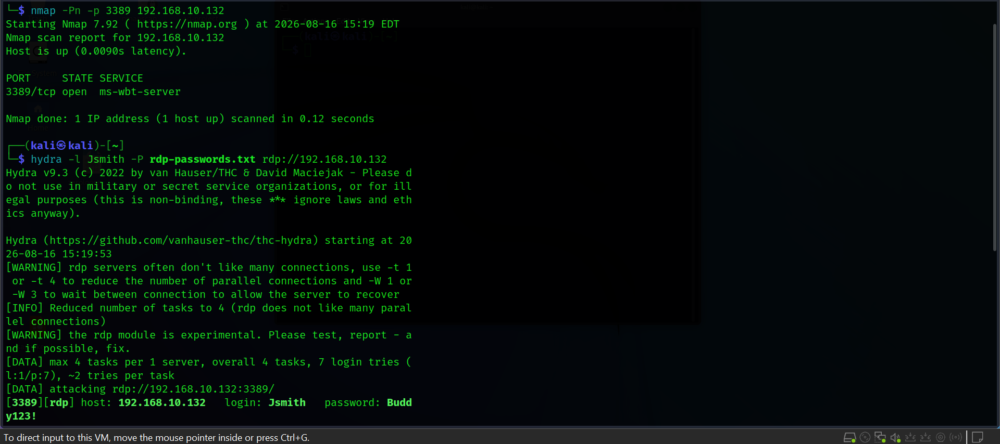
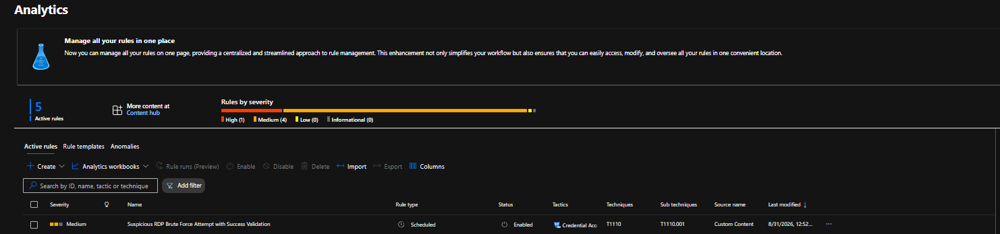
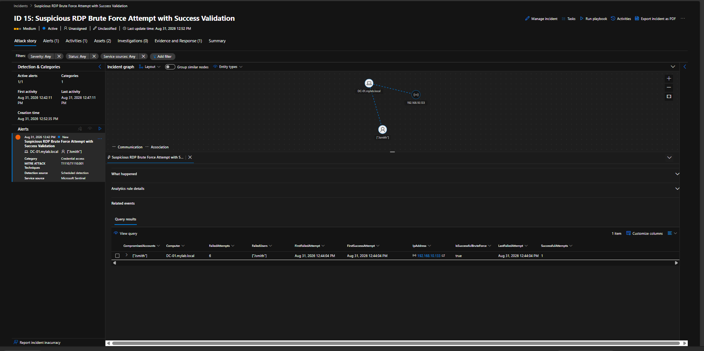
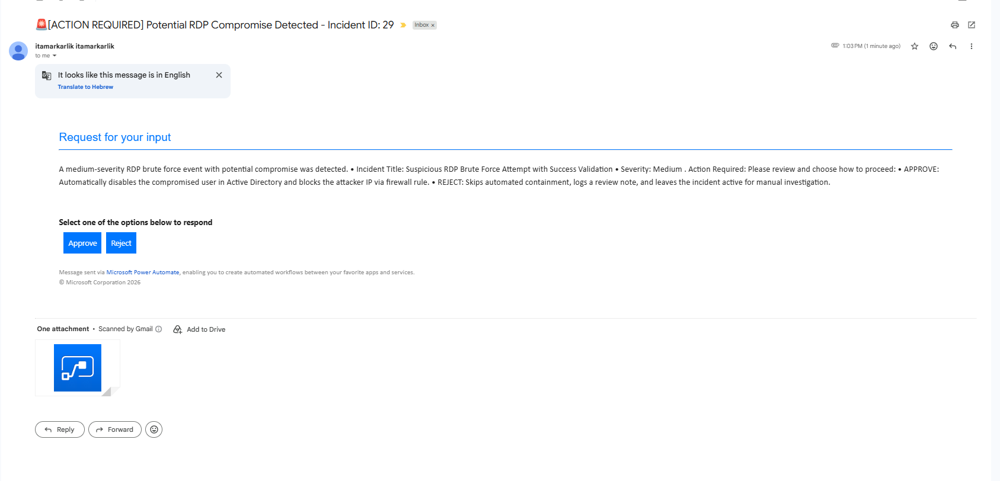
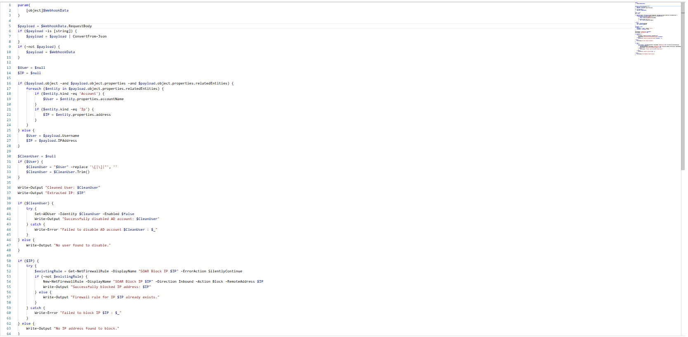
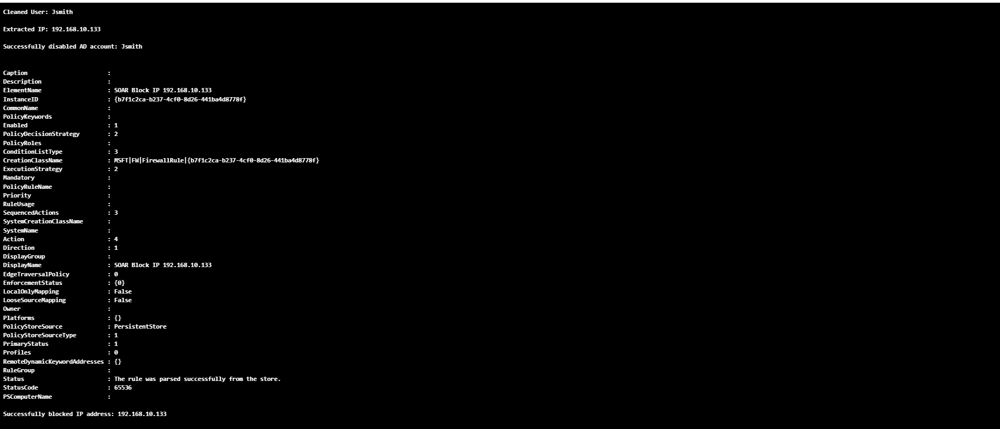
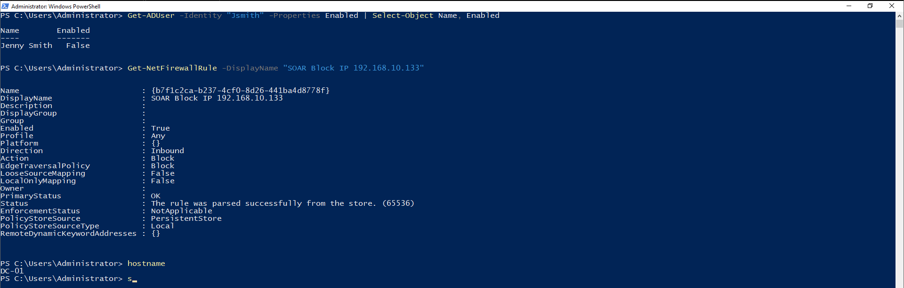
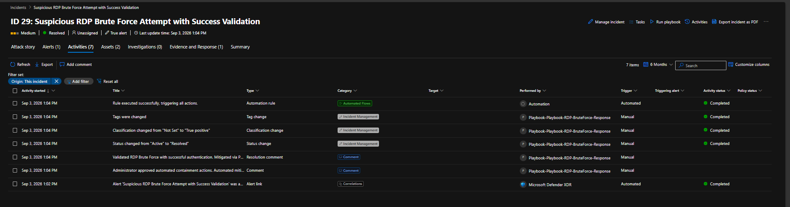
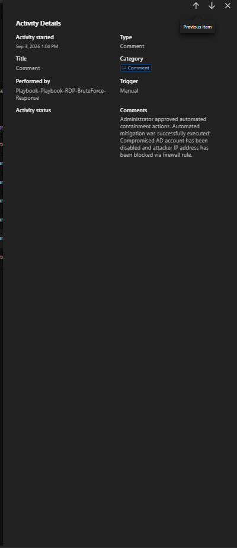

# 🤖 SOAR: Automated RDP Brute Force Response

## 📌 Overview

This project demonstrates an end-to-end **SOAR (Security Orchestration, Automation and Response)** workflow for responding to an **RDP Brute Force attack** detected by a custom Microsoft Sentinel Analytic Rule.

The SOAR workflow was built as the automated response layer following **Detection Rule 5: Suspicious RDP Brute Force Attempt with Success Validation**.

The project demonstrates how detection logic written in **KQL** can feed a Sentinel Incident with relevant entities such as the attacker IP, target host, and compromised account, which are then consumed by the SOAR playbook for automated response.

### Attack → Detection → Response

```text
RDP Brute Force Attack
          │
          ▼
Windows Security Events
4625 Failed Logons
4624 Successful Logon
          │
          ▼
Detection Rule 5
(KQL Correlation)
          │
          ▼
Microsoft Sentinel Incident
          │
          ▼
SOAR Playbook Triggered
          │
          ▼
Extract IP + Account + Host
          │
          ▼
Analyst Approval
          │
     ┌────┴────┐
     ▼         ▼
  Approve    Reject
     │         │
     ▼         ▼
Automated   Manual
Containment Investigation
     │
     ├── Disable AD Account
     ├── Block Attacker IP
     └── Update Incident
````

---

## 🎯 Attack Scenario

The workflow was developed following a controlled **RDP Brute Force attack** performed from a Kali Linux attacker machine.

The attack targeted the domain account:

```text
MYLAB\Jsmith
```

The attacker generated multiple authentication attempts against the Windows target.

The attack resulted in:

* Multiple `4625` Failed Logon events
* A subsequent `4624` Successful Logon
* Successful RDP authentication
* Identification of the source IP: `192.168.10.133`

This activity was used to develop and validate the custom Sentinel detection.



---

## 🔍 Detection: Microsoft Sentinel Analytic Rule

The attack generated authentication telemetry that was collected by Microsoft Sentinel.

A custom analytic rule was created to detect:

* `Event ID 4625` — Failed Logon
* `Event ID 4624` — Successful Logon
* `Logon Type 10` — RemoteInteractive / RDP
* ≥5 failed authentication attempts
* Successful authentication following the failed attempts

The rule correlates the failed and successful authentication activity using the **source IP and target computer**.

### Detection Rule

**Suspicious RDP Brute Force Attempt with Success Validation**

* **Severity:** Medium
* **Tactic:** Credential Access
* **Technique:** `T1110.001 - Password Guessing`
* **Schedule:** Every 5 minutes
* **Lookup Window:** 5 minutes



---

## 💻 KQL Detection Logic

The detection is implemented using KQL against the Windows `SecurityEvent` table.

The query first identifies repeated failed logons (`4625`) and groups them by **source IP and target computer**. It then searches for successful logons (`4624`) and correlates them with the failed activity.

When a successful authentication follows the failed attempts, the query sets:

```text
IsSuccessfulBruteForce = true
```

and exposes the relevant account through:

```text
CompromisedAccounts
```

These detection results are important to the SOAR workflow because the Sentinel Incident provides the entities that the playbook uses for automated response.

In other words:

```text
KQL Detection
     │
     ├── IpAddress
     ├── Computer
     └── CompromisedAccounts
              │
              ▼
     Sentinel Incident
              │
              ▼
        SOAR Playbook
```

The KQL query itself is maintained as part of **Detection Rule 5**, while this project focuses on how the resulting Sentinel incident is automatically processed by the SOAR workflow.

---

## 🚨 Sentinel Detection Result

The analytic rule successfully detected the simulated attack and generated a Sentinel incident.

Detection results included:

```text
Source IP:              192.168.10.133
Target Host:            DC-01.mylab.local
Target Account:         Jsmith
Failed Attempts:        13
Successful Attempts:    1
Successful Brute Force: true
```

The successful authentication confirmed that the brute-force activity potentially resulted in account compromise.



---

# ⚙️ SOAR Playbook

Once the Sentinel incident was created, the SOAR playbook was triggered automatically.

The playbook receives the Sentinel Incident and extracts the entities generated by the detection:

* **Account:** `Jsmith`
* **Source IP:** `192.168.10.133`
* **Host:** `DC-01.mylab.local`

These entities are then passed through the automated response workflow.

The successful execution of the playbook can be seen below. The workflow completed successfully and processed the incident through the configured decision and response stages.


### Playbook Flow

The implemented workflow performs the following high-level actions:

```text
Microsoft Sentinel Incident
          │
          ▼
Entities - Get Accounts
          │
          ▼
Entities - Get IPs
          │
          ▼
Entities - Get Hosts
          │
          ▼
Condition
          │
          ▼
Send Approval Email
          │
          ▼
Analyst Decision
      ┌───┴───┐
      ▼       ▼
    True     False
      │       │
      ▼       ▼
  Continue   Add Comment
      │
      ▼
   Create Job
      │
      ▼
 Add Comment
      │
      ▼
Update Incident
```

The playbook uses the entities produced by the detection as the bridge between **SIEM detection** and **automated response**.

---

## 📧 Human-in-the-Loop Approval

Before performing disruptive containment actions, the playbook sends an approval request to the SOC analyst.

The analyst can:

* **Approve** → Continue with automated containment
* **Reject** → Stop automated remediation and leave the incident for manual investigation

This human approval step prevents potentially disruptive actions from being performed automatically without analyst validation.



---

## 🛡️ Automated Containment

After approval, the SOAR workflow creates a remediation job that executes the required containment actions through Azure Automation.

### 1. Disable Compromised AD Account

The identified account is disabled in Active Directory:

```powershell
Set-ADUser -Identity $CleanUser -Enabled $false
```

### 2. Block Attacker IP

A Windows Firewall rule is created to block inbound traffic from the attacker's IP:

```powershell
New-NetFirewallRule `
    -DisplayName "SOAR Block IP $IP" `
    -Direction Inbound `
    -Action Block `
    -RemoteAddress $IP
```





---

## 🧪 Remediation Validation

The automated actions were validated directly on the target system.

### Active Directory Validation

```powershell
Get-ADUser -Identity "Jsmith" -Properties Enabled |
Select-Object Name, Enabled
```

Result:

```text
Name         Enabled
----         -------
Jenny Smith  False
```

The account was successfully disabled.

### Firewall Validation

```powershell
Get-NetFirewallRule -DisplayName "SOAR Block IP 192.168.10.133"
```

The resulting rule confirmed:

```text
Enabled   : True
Direction : Inbound
Action    : Block
```



---

## 📝 Sentinel Incident Response

The SOAR workflow automatically documented the response actions inside the Sentinel incident.

The incident was:

* Classified as a **True Positive**
* Updated with remediation comments
* Resolved after successful containment
* Documented for audit purposes

This creates a complete investigation trail from the original detection through the automated response and final incident resolution.





---

## 🔄 Complete Attack Chain

The complete lab demonstrates the following SOC workflow:

```text
1. RDP Service Discovered
          ↓
2. RDP Brute Force Attack
          ↓
3. 4625 Failed Logons
          ↓
4. 4624 Successful Logon
          ↓
5. KQL Correlation
          ↓
6. Sentinel Analytic Rule 5
          ↓
7. Sentinel Incident Created
          ↓
8. SOAR Playbook Triggered
          ↓
9. IP + Account + Host Extracted
          ↓
10. SOC Analyst Approval
          ↓
11. Create Remediation Job
          ↓
12. Disable Compromised AD Account
          ↓
13. Block Attacker IP
          ↓
14. Validate Remediation
          ↓
15. Update & Resolve Incident
```

---

## 🧩 Technologies Used

| Technology                          | Purpose                                   |
| ----------------------------------- | ----------------------------------------- |
| **Kali Linux**                      | RDP brute-force simulation                |
| **Windows Security Events**         | Authentication telemetry (`4624`, `4625`) |
| **KQL**                             | Detection and correlation logic           |
| **Microsoft Defender for Endpoint** | Endpoint telemetry and investigation      |
| **Microsoft Sentinel**              | SIEM, detection and incident management   |
| **Azure Automation**                | Automated remediation execution           |
| **Power Automate / Logic Apps**     | SOAR orchestration and approval           |
| **PowerShell**                      | Automated containment                     |
| **Active Directory**                | Account containment                       |
| **Windows Firewall**                | Attacker IP blocking                      |

---

## 🛡️ MITRE ATT&CK

The attack and detection chain maps to multiple MITRE ATT&CK techniques:

* **T1110.001 — Brute Force: Password Guessing**
* **T1021.001 — Remote Services: RDP**
* **T1078 — Valid Accounts**

The custom analytic rule focuses on **T1110.001**, while the successful RDP activity provides additional context for the potential compromise.

---

## 🎯 SOC Investigation & Response Value

This lab demonstrates more than simply detecting a brute-force attack.

It shows how a SOC can connect multiple stages of the incident lifecycle:

```text
Detection
   ↓
Correlation
   ↓
Entity Extraction
   ↓
Incident Creation
   ↓
Analyst Validation
   ↓
Automated Containment
   ↓
Remediation Validation
   ↓
Incident Documentation
```

The combination of **KQL-based detection**, **Microsoft Sentinel incident management**, and **SOAR automation** demonstrates how repetitive SOC response tasks can be automated while keeping a human analyst in control of disruptive actions.

---

## ✅ Final Result

The lab successfully demonstrated an end-to-end SOC detection and response workflow:

**Attack → Detection → Correlation → Incident → Entity Extraction → Approval → Automated Containment → Validation → Resolution**

The project demonstrates how a SOC can combine **SIEM detection with SOAR automation** to reduce response time while maintaining analyst control over potentially disruptive remediation actions.

> **Lab Scope:** Developed and tested in an isolated SOC home lab environment for defensive security research and SOC Tier 1 training.

````

### מה שיניתי בעיקר

1. **הוספתי את התמונה שלך** מיד אחרי ה־SOAR Playbook, עם:
   ```markdown
   
````

6. הוספתי **SOC Investigation & Response Value**, שלדעתי מחזק מאוד את הפרויקט מבחינת Recruiter: זה מראה שאתה לא רק יודע לכתוב Rule אלא מבין את השרשרת **Detection → Triage/Approval → Response → Validation → Documentation**.
