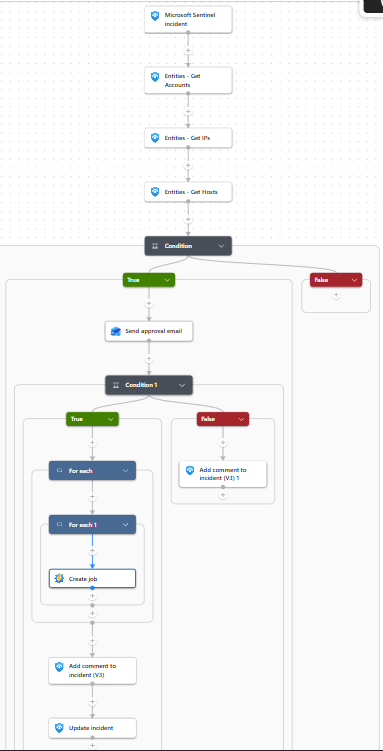
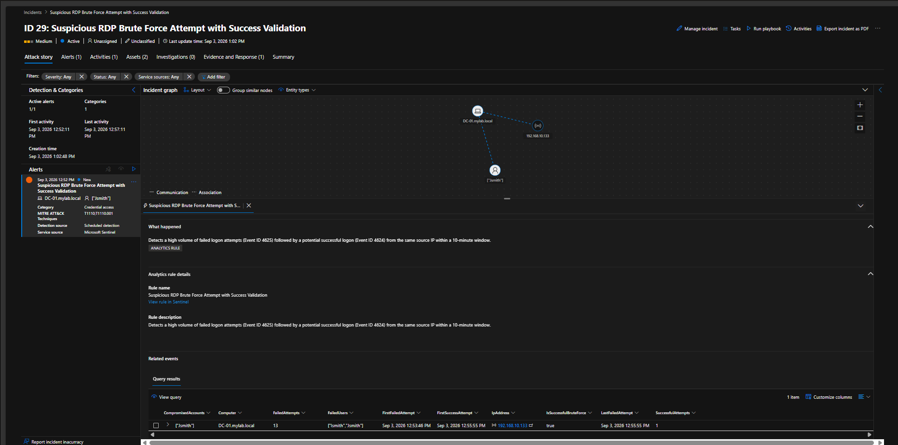

# 🤖 SOAR: Automated RDP Brute Force Response

## 📌 Overview

This project demonstrates an automated **SOAR (Security Orchestration, Automation and Response)** workflow for responding to a detected **RDP Brute Force attack**.

The workflow integrates:

- **Microsoft Sentinel** – Detection & Incident Management
- **Microsoft Power Automate / Logic App** – Orchestration & Approval
- **Azure Automation** – Automated Runbook Execution
- **PowerShell** – Remediation
- **Active Directory** – Account Containment
- **Windows Firewall** – IP Blocking

The playbook follows a **Human-in-the-Loop (HITL)** approach, requiring analyst approval before executing containment actions.

---

## 🔄 SOAR Workflow

```text
Microsoft Sentinel Incident
          │
          ▼
   Extract IP & Account
          │
          ▼
     Verify Entities
          │
          ▼
   Send Approval Email
          │
     ┌────┴────┐
     ▼         ▼
  Approve    Reject
     │         │
     ▼         ▼
Runbook     Add Comment
     │
     ├── Disable AD Account
     │
     ├── Block Attacker IP
     │
     └── Update Sentinel Incident
```

## 🏗️ Playbook Architecture



---

## 🚨 Trigger: RDP Brute Force Detection

The workflow begins when Microsoft Sentinel detects a suspicious RDP brute-force attack.

The incident contains the relevant entities:

- **Source IP:** `192.168.10.133`
- **Compromised Account:** `Jsmith`
- **Target Host:** `DC-01.mylab.local`



---

## 📧 Analyst Approval

Before executing containment actions, the playbook sends an approval request to the SOC analyst.

The analyst can either:

- **Approve** → Continue with automated containment
- **Reject** → Stop remediation and leave the incident for manual investigation


---

## ⚙️ Automated Remediation

After approval, the Azure Automation Runbook performs two containment actions.

### 1. Disable Compromised AD Account

The runbook extracts the affected account and disables it in Active Directory.

```powershell
Set-ADUser -Identity $CleanUser -Enabled $false
```

### 2. Block Attacker IP

The runbook creates an inbound Windows Firewall rule to block the identified source IP.

```powershell
New-NetFirewallRule `
    -DisplayName "SOAR Block IP $IP" `
    -Direction Inbound `
    -Action Block `
    -RemoteAddress $IP
```


---

## 🧪 Validation

The remediation was validated directly on the endpoint.

### Active Directory

The compromised account was successfully disabled:

```powershell
Get-ADUser -Identity "Jsmith" -Properties Enabled |
Select-Object Name, Enabled
```

**Result:**

```text
Name         Enabled
----         -------
Jenny Smith  False
```

### Windows Firewall

The attacker IP was successfully blocked:

```powershell
Get-NetFirewallRule -DisplayName "SOAR Block IP 192.168.10.133"
```

The firewall rule was confirmed as:

```text
Enabled   : True
Direction : Inbound
Action    : Block
```


---

## 📝 Incident Documentation

The playbook automatically records the remediation activity inside the Sentinel incident, providing an audit trail of the actions performed.


---

## ✅ Final Result

The complete workflow successfully demonstrated:

- RDP brute-force detection
- Incident creation in Microsoft Sentinel
- Entity extraction
- Human approval workflow
- Automated AD account disablement
- Automated attacker IP blocking
- Sentinel incident updates
- Remediation validation
- Automated incident documentation

The incident was successfully **contained and resolved through an automated SOAR workflow** while maintaining analyst approval and an auditable response process.

---

## 🛡️ Security Value

This workflow demonstrates how a SOC can move from **detection → investigation → approval → containment → validation** while reducing manual response time.

**Key concept:** Human approval is maintained before disruptive containment actions, while the actual remediation is automated once approved.
